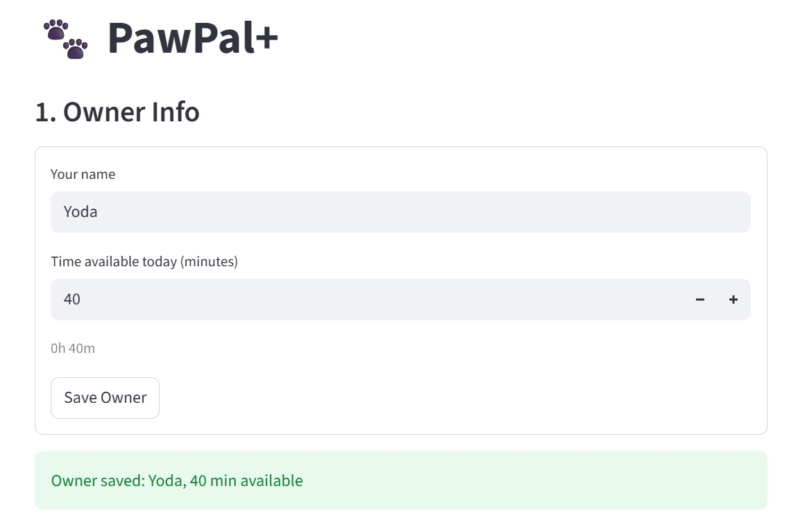
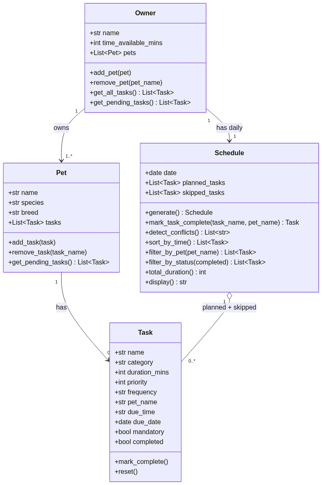

# PawPal+ (Module 2 Project)

You are building **PawPal+**, a Streamlit app that helps a pet owner plan care tasks for their pet.

## Scenario

A busy pet owner needs help staying consistent with pet care. They want an assistant that can:

- Track pet care tasks (walks, feeding, meds, enrichment, grooming, etc.)
- Consider constraints (time available, priority, owner preferences)
- Produce a daily plan and explain why it chose that plan

Your job is to design the system first (UML), then implement the logic in Python, then connect it to the Streamlit UI.

## What you will build

Final app can:

- Let a user enter basic owner + pet info
- Let a user add tasks (duration + priority at minimum)
- Generate a daily schedule/plan based on constraints and priorities
- Display the plan clearly (and ideally explain the reasoning)
- Include tests for the most important scheduling behaviors

## Getting started

### Setup

```bash
python -m venv .venv
source .venv/bin/activate  # Windows: .venv\Scripts\activate
pip install -r requirements.txt
```

### Run the Streamlit app

```bash
streamlit run app.py
```

### Run the demo script

```bash
python main.py
```

### Run the tests

```bash
python -m pytest
```

## Features

- Task management: create tasks with a name, category, duration, priority, frequency, and optional due time — each task is linked to a specific pet
- Pet profiles: store pet details and manage their task list, including adding and removing tasks
- Owner setup: register multiple pets under one owner with a daily time budget
- Priority-based scheduling: the scheduler selects tasks in priority order (1 = highest) and fits them within the owner's available time
- Mandatory tasks: tasks flagged as mandatory are always scheduled first, regardless of priority or time remaining
- Sorting by time: planned tasks can be sorted chronologically by their due time (HH:MM)
- Conflict warnings: the scheduler detects when two tasks share the same time slot and surfaces a warning in the UI
- Daily recurrence: completing a daily or weekly task automatically creates the next occurrence with an updated due date
- Filtering: tasks can be filtered by pet name or completion status
- Streamlit UI: a multi-section web app lets users set up their owner, add pets and tasks, and generate and view today's schedule

## Smarter Scheduling

The scheduler in `pawpal_system.py` includes improvements on top of basic priority sorting:

- Mandatory tasks first: tasks flagged as mandatory (e.g. medications) are always scheduled first, before any optional tasks
- Future date filtering: tasks with a due date set in the future are automatically excluded from today's plan
- Tie-breaking by duration: when tasks share the same priority, shorter ones are picked first to fit more into the time budget
- Gap-filling: after the main pass, the scheduler does a second pass to slot any skipped tasks into leftover time
- Conflict detection: prints a warning if two tasks are assigned the same time slot
- Auto-renewal: completing a daily or weekly task automatically creates the next occurrence with an updated due date

## Testing PawPal+

Run the full test with:

```bash
python -m pytest
```

### What the tests cover

- Task and pet management: completion, reset, adding tasks, pet name stamping, remove guards
- Scheduling: time budget enforcement, priority ordering, happy path (all tasks fit)
- Sorting: chronological order, tasks without a time slot go last
- Recurrence: daily and weekly renewal creates the next occurrence; "as needed" tasks don't renew; renewed tasks are excluded from today's schedule
- Conflict detection: flags duplicate time slots, ignores tasks with no time set

### Confidence Level

★★★★☆ (4/5)

Core logic is well covered across both happy paths and edge cases. Still not every possible combination of constraints (e.g. multiple pets with mixed mandatory/optional tasks) has an explicit test yet.

### Demo
<a href="imgs/demo.jpg" target="_blank"></a>

### UML diagram
<a href="imgs/uml-design.png" target="_blank"></a>
